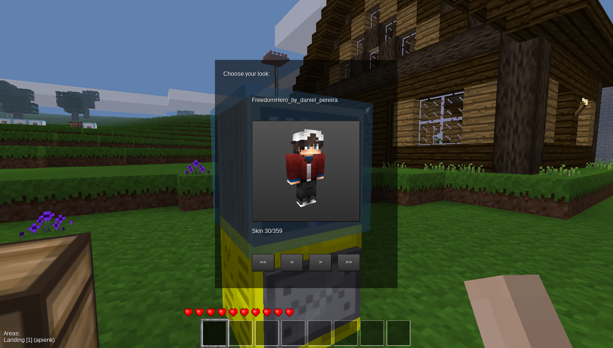

# Wardrobe Minetest Mod

This mod provides a very simple way to change the skin on the default character
mesh.  Unlike other skin-changing mods out there, it does not attempt to change
the character mesh, does not provide for the old 2D billboard-type character
appearance, and does not depend on any kind of inventory extension mods.  It
also does not rely on running external scripts, downloading skins from a
server, or anything of that nature.

Changing skins is done via a new "wardrobe" node, which brings up a form with
skin names when you right-click on it (like a chest or furnace).  Choosing a
skin instantly changes your character's appearance, and this change is kept if
you log out (unless the skin is removed from the server, in which case your
appearance will revert to the default when you log in).

The list of skins is static and determined when the server starts based on two
files: <modsPath>/wardrobe/skins.txt and <worldPath>/skins.txt.  Both files
have the same syntax (see "Skins File Syntax" below).  The simplest way to add
a skin is to either drop the texture and its preview into the <modsPath>/wardrobe/textures
directory or add them to a texture pack, then add the simple name of the
texture file to one of these skins.txt files.

For convenience, some SVG images have been included with this mod.  One
("skinTemplate.svg") shows the exact layout of a Minetest skin for the default
character model, and should be useful for creating new skins.  This layout is
also (mostly?) compatible with Minecraft skins.  The others can be used to
create higher resolution textures for the wardrobe object, in case you are
using a texture pack with resolutions greater than 16x16.  Skins too may be
higher resolution as long as they have an aspect ratio of 2:1.  The author of
this mod created a very high resolution version of the default character and it
works well (but has not been included to simplify mod licensing).

The mod expects skin previews to be available. Previews are 400x400 PNG files
named texturename_btn.png -- that is, for a texture named **john_snow.png**
the corresponding preview should be named **john_snow_btn.png**. A good way to generate
previews is to use [Minecraft Skin Viewer](http://www.minecraftforum.net/forums/mapping-and-modding-java-edition/minecraft-tools/1261408-minecraft-skin-viewer-1-2-supports-1-8-skins). A good source of skins is [Addis Open-MT Skin Database](http://minetest.fensta.bplaced.net) which contains over 1000 skins.

### Some example skins were added:

- Jojoa1997 by Jojoa1997 http://minetest.fensta.bplaced.net/#name=jojoa1997 (CC BY-SA 3.0)
- oOChainLynxOo 18 Birthday Skin by WidDos http://minetest.fensta.bplaced.net/#name=oOChainLynxOo%2018%20Birthday%20skin (CC BY-NC-SA 3.0)
- Charlotte by Sporax http://minetest.fensta.bplaced.net/#name=Charlotte (CC BY-SA 3.0)
- Morgane by loupicate http://minetest.fensta.bplaced.net/#name=Morgane (CC BY-SA 3.0)

Skins File Syntax
-----------------

A comment line starts with two dashes (like in Lua), but must be the only thing
on the line:

   -- This is a comment and has no effect.

Except for empty lines and comments, each line names a texture (file) and a
name, separated by optional whitespace and a colon (:):

   texture_file_name.png: My Skin
   skin_other_texture_file_name.png: Other Skin

The first string (e.g. "texture_file_name.png") will be passed to the minetest
API just like any other node or item texture.  Generally it is simply the whole
file name of an image in a mod "texture" directory or texture pack.  The second
string (e.g. "My Skin") is presented to the player in-world as the name of the
texture.  If this name is omitted, as in:

   texture_file_name.png
   skin_other_texture_file_name.png

Then a name is constructed by removing any ".png" suffix any optional "skin_"
or "wardrobe_skin_" prefix, and replacing underscores with spaces.  So the
above skins would be named "texture file name" and "other texture file name",
respectively.

To remove a skin that was added elsewhere (for example, to a remove a skin in a
particular world), prepend a minus sign (-) to the line.  For example:

   -skin_other_texture_file_name.png

would remove the "skin_other_texture_file_name.png" skin no matter where it was
specified or what name it was given.

Mod Details
-----------

Required Minetest Version: >=0.4.12 (not tested in earlier versions)

Dependencies: default, wool (both included in minetest_game)

Recipe (**Disabled in this fork!**):

   * W - any wood (same kinds you can make a chest from)
   * S - any stick
   * L - any wool

   wardrobe:
      W S W
      W L W
      W L W

Git Repo: https://github.com/prestidigitator/minetest-mod-wardrobe

Copyright and Licensing
-----------------------

All contents, including source code, documentation, and images, are the
original creations of the mod author.

Authors: prestidigitator, Andrzej Pieńkowski
License: WTFPL (all content except example skin textures)

Change History
--------------

Version 1.0

* Released 2014-07-05
* First working version

Version 1.1

* Released 2015-04-24
* Removed farming as a dependency; wool is from wool.
* Auto-detection of player mesh name (thank you indriApollo).
* Removed warning caused by access of uninitialized global variale (even though
  it was just a check for nil).

Version 1.2

* Released 2017-11-25
* Added skin previews
* New formspec
* Disabled craft (part of MinetestEDU modpack, teachers should be able to use the wardrobe as a reward for students)
